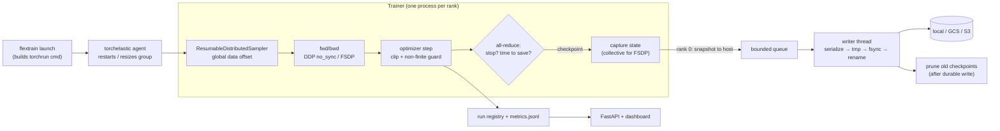

# FlexTrain

[](https://github.com/Varun-Dudipala/flextrain/actions/workflows/ci.yml)


A compact, fault-tolerant distributed training framework for PyTorch. It wraps DDP / FSDP
training with the machinery long-running jobs need to survive the real world: **non-blocking
checkpoints, exact resume after crashes, elastic resizing, and coordinated preemption**, each
covered by tests – including real multi-process `torchrun` jobs with injected failures.

```text
$ flextrain launch -c examples/gpt2_training/config.yaml --nproc-per-node 2 examples/gpt2_training/train_gpt2.py
step 20 | loss 4.1425 | lr 1.00e-03 | grad_norm 1.657 | 119 samples/s
Checkpoint step 20 queued (blocked 5.1 ms)          <- training resumes immediately
Checkpoint written: .../checkpoint_step00000020.pt  <- background thread, fsync'd, atomic
...
```

## What it guarantees (and how that is tested)

| Guarantee | Mechanism | Proven by |
|---|---|---|
| **Exact resume** – crash at step *k*, resume, and the final weights are *bitwise identical* to an uninterrupted run | checkpoints hold model, optimizer, LR schedule, grad scaler, every rank's RNG state and the sampler's global data position | `tests/unit/test_trainer.py::TestExactResume`, `tests/integration/…::test_worker_crash_is_recovered_by_elastic_restart` |
| **Non-blocking checkpoints** – the step loop pauses only for a device→host snapshot | snapshot into reusable (pinned) host buffers; serialize + write + `fsync` on a single FIFO background thread with bounded in-flight saves | `tests/unit/test_async_writer.py`, [benchmarks](#benchmarks) |
| **Failure recovery** – a crashed rank restarts the job from the newest *valid* checkpoint | torchelastic restarts the worker group → auto-resume (corrupted checkpoints are skipped); hangs become errors via the collective timeout | `test_worker_crash_is_recovered_by_elastic_restart`, `test_corrupted_latest_falls_back_to_previous` |
| **Elastic resizing** – resume on a different number of GPUs without repeating or skipping data, with the same global batch | data position is tracked as a *global* sample offset and re-sharded for the new world size; gradient accumulation is re-derived from `global_batch_size` | `test_elastic_resize_resumes_from_exact_global_data_position`, `tests/unit/test_sampler.py` |
| **Coordinated preemption** – SIGTERM to *any one* rank stops *all* ranks after the same step with one consistent checkpoint | signal handler only sets a flag; ranks agree via an all-reduce at step boundaries | `test_sigterm_to_one_rank_stops_all_ranks_at_the_same_step` |
| **Crash-safe storage** – a checkpoint is never observed half-written; retention never deletes the last good one | temp file → `fsync` → `os.replace` → `fsync(dir)`; pruning runs only after a durable write, computed from storage (survives restarts) | `tests/unit/test_storage.py`, `tests/unit/test_checkpoint_manager.py` |
| **Divergence guard** – NaN/Inf steps are skipped; persistent divergence fails fast so the agent can roll back | decision uses the post-all-reduce gradient norm, identical on every rank | `TestDivergenceGuard` |

DDP training is verified to stay bitwise-identical across ranks and to match single-process
training with gradient accumulation (`test_two_ranks_match_single_process_with_accumulation`).

## Quick start

```bash
pip install -e ".[dev]"     # CPU-only machines work: CI runs everything on CPU with the gloo backend

# Single process: a tiny byte-level GPT-2 trained on this repo's own source code (no downloads)
python examples/gpt2_training/train_gpt2.py

# Two workers under the elastic agent. Kill one (kill -9 <pid>) and watch the group restart and resume.
flextrain launch -c examples/gpt2_training/config.yaml --nproc-per-node 2 examples/gpt2_training/train_gpt2.py

flextrain status --all      # runs from the registry: status, step, loss, restarts, last checkpoint
flextrain serve             # REST API + live dashboard at http://127.0.0.1:8000
```

Use it in your own code:

```python
from flextrain import Trainer, load_config

config = load_config("config.yaml")            # strict: typos and bad types are errors
with Trainer(model, config, train_dataset, eval_dataset=val_dataset) as trainer:
    result = trainer.train()                    # auto-resumes if checkpoints exist
print(result.status, result.global_step)        # "completed" or "preempted"
```

The model receives the batch (`model(**batch)` for dicts) and returns a scalar loss, a
`(logits, loss)` tuple, or anything with a `loss` field; override `Trainer.compute_loss` otherwise.

## How it works



**Async checkpointing.** Saving is split into the part that must be consistent with training and
the part that is merely slow. `capture_state` gathers model/optimizer state (wrapper-agnostic via
`torch.distributed.checkpoint.state_dict`, so a DDP checkpoint loads into FSDP or a single GPU), and
the snapshot copies it into host buffers that are allocated once and reused (pinned for CUDA, with
tied weights de-duplicated). Everything after that – pickling, writing, `fsync`, retention – runs on
one background thread. One writer keeps saves strictly ordered so "latest" always means "highest
step"; a bound on in-flight snapshots gives backpressure instead of unbounded host memory; and a
failed background write is re-raised on the training thread at the next save, because a checkpoint
that silently failed is the worst way to discover you have no checkpoint.

**Exact & elastic resume.** Each epoch has one deterministic global permutation. The sampler
splits the *unconsumed suffix* across the current ranks so that optimizer step *k* always consumes
the contiguous block `perm[k·G:(k+1)·G]` (G = global batch), whatever the world size. Progress is
therefore a single topology-independent integer, which is what makes resizing exact. With
`training.global_batch_size` set, 2 ranks × accumulation 1 becomes 1 rank × accumulation 2 after a
resize, so the optimization trajectory is unchanged.

**Failure handling.**

| Failure | What happens |
|---|---|
| Worker process crashes (OOM, exception, `kill -9`) | Peers' collectives error out; the elastic agent restarts all workers (up to `elastic.max_restarts`); they resume from the newest valid checkpoint |
| Worker hangs (deadlock, dead NIC) | `distributed.timeout_minutes` turns the stuck collective into an error → same as a crash |
| Node joins/leaves (`--nnodes=MIN:MAX`) | Agent re-rendezvouses with the new size; data and batch geometry are re-derived on resume |
| Preemption / SIGTERM / SLURM SIGUSR1 / Ctrl-C | Coordinated stop at the next step boundary, blocking checkpoint, `train()` returns `"preempted"`; a second Ctrl-C forces exit |
| Latest checkpoint corrupted | Skipped with a warning; resume falls back to the previous one |
| Writer dies mid-save | Only a hidden temp file is left (cleaned up on next start); previous checkpoints untouched |
| Storage write fails | Retried with backoff (cloud blips), then surfaced on the training thread; older checkpoints are never pruned |
| Loss/gradients become NaN/Inf | Step skipped; > `max_consecutive_nonfinite` in a row raises so the job restarts from the last good state |

## Benchmarks

`scripts/benchmark.py` measures the example GPT-2 small (124M parameters) with a *realistic*
checkpoint – weights **and** AdamW state, 1.49 GB – reporting medians of repeated runs.
Reproduce with `make bench` (see `python scripts/benchmark.py --help`).

Measured on a 4-vCPU cloud VM without a GPU (torch 2.14, virtual disk):

| GPT-2 small + AdamW checkpoint (1.49 GB) | Result |
|---|---|
| Training stall per checkpoint, synchronous save | 10.4 s |
| Training stall per checkpoint, **async save** | **0.19 s (−98%)** |
| First async save (allocates the reusable host buffers once) | 0.42 s |
| Background persist throughput (serialize + write + `fsync`) | 231 MB/s |
| Checkpoint load throughput (page cache evicted first) | 1.7 GB/s |
| Resume: load + restore model and optimizer | 3.0 s |

End to end – 35 training steps with a checkpoint every 10 – checkpointing costs **80%** extra wall
time with synchronous saves and **59%** with async saves (−26%; a 20-step run measured −45%).
The end-to-end gain is much smaller than the stall reduction *on this machine* because CPU
training and the background writer compete for the same 4 cores and memory bandwidth (the
benchmark leaves one core free for the writer with `--threads 3`; without that the gain nearly
disappears). In GPU training the host is mostly idle while the GPU computes, which is the case
the design targets; run `make bench` on a GPU machine to measure it there.

Methodology notes – mistakes an earlier version of this benchmark made, now fixed:

- *Load throughput read the file it had just written*, i.e. from the OS page cache. The page cache
  is now evicted first (`posix_fadvise(POSIX_FADV_DONTNEED)`); on virtualized disks the host may
  still cache blocks, so treat load numbers as an upper bound.
- *Checkpoints contained weights only.* Real checkpoints include optimizer state (~3× larger).
- *Single samples.* Now medians of repeats, with the one-time buffer allocation reported separately.

<details>
<summary>Earlier v0.1 measurements on a Tesla T4 (Colab)</summary>

Weights-only 500 MB checkpoint, single run, pre-dating the fixes above: async save blocked for
602 ms vs. ~3.9 s synchronous (127.7 MB/s), i.e. −85% stall; checkpoint load 1,169 MB/s (warm page
cache); resume 3.1 s; training 3,690 tokens/s at batch 8 × 512. Re-measure with the current
script for comparable numbers.

</details>

## Tests

```bash
make test               # everything (~2 min on a laptop CPU)
make test-unit          # fast unit tests
make test-integration   # real torchrun jobs (gloo backend) with injected failures
pytest tests/gpu        # CUDA-only paths (AMP bf16/fp16, pinned snapshots); skipped without a GPU
```

246 test cases (parametrized cases counted individually; ~2.3k lines of tests for ~3.8k lines of
library code):

| Area | What is verified |
|---|---|
| Config (63) | type coercion incl. YAML `1e-4`, unknown-key errors with suggestions, every validation rule, overrides, round-trips |
| Checkpointing (45) | atomic writes leave no partial files, failed writes keep the previous checkpoint, async saves return before the write and are isolated snapshots, FIFO order, backpressure, drain on close, failures surface once, retention across restarts, corrupted-checkpoint fallback, GCS/S3 against fakes |
| Trainer (37) | exact (bitwise) resume after a crash and after preemption, accumulation ≡ large batch, activation checkpointing ≡ none, divergence guard, LR schedules, checkpoint policy, eval, tracking |
| Sampler / elastic / fault tolerance (39) | resume mid-epoch, re-sharding across world sizes without repeats or gaps, global-batch preservation, torchrun command construction, per-attempt rendezvous isolation, signal handling |
| API / CLI / tracking (39) | endpoints, stale-run detection, CLI commands end to end, crash-tolerant JSONL, atomic registry |
| Multi-process integration (6) | real `torchrun` jobs: DDP sync, crash → elastic restart → bitwise-identical result, coordinated preemption, 2→1 rank resize |
| Example + GPU (17) | GPT-2 causality and shapes, example script end to end; CUDA AMP / pinned snapshots (GPU only) |

The integration tests found a real race: on an elastic restart, a worker could read its peer's
rendezvous address from the *previous* attempt and hang (4 of 6 runs). Workers now namespace the
rendezvous store per restart attempt; the test has passed in every run since.

## Configuration

One YAML file with typed, validated sections – `flextrain init-config` writes every option with
its default, and `flextrain validate cfg.yaml --world-size 8` shows the derived batch geometry.
Parsing is strict: unknown keys fail with a suggestion (`did you mean 'learning_rate'?`), and
values are coerced to their declared types (so YAML's `1e-4`, which PyYAML reads as a *string*,
works). Any value can be overridden with `--set section.key=value`.

| Section | Highlights |
|---|---|
| `main` | experiment / run name, output dir, seed, log level |
| `training` | per-device `batch_size`, `gradient_accumulation_steps` or `global_batch_size`, optimizer, warmup + cosine/linear schedule, `max_steps` / `max_epochs`, eval cadence |
| `distributed` | `ddp` / `fsdp`, backend, collective timeout, FSDP sharding/prefetch/offload, `wrap_modules`, bf16/fp16, activation checkpointing |
| `checkpoint` | dir / `local`·`gcs`·`s3`, step- and time-based intervals, async + max in-flight saves, retention, resume policy |
| `elastic` | nodes `min:max`, procs per node, rendezvous, `max_restarts` |
| `fault_tolerance` | handled signals, stop-check interval, non-finite guard |
| `model`, `data` | free-form, passed through to your script |

## Project layout

```text
flextrain/
├── config/           typed config sections, strict loader, overrides
├── core/             Trainer, process-group setup, resumable sampler, DDP/FSDP wrapping
├── checkpoint/       storage backends, snapshot buffers, async writer, manager
├── fault_tolerance/  coordinated preemption, non-finite guard
├── elastic/          torchrun launcher, resize-aware resume
├── tracking/         JSONL metrics, run registry
├── api/              FastAPI service + dashboard
└── cli/              flextrain launch | validate | init-config | status | inspect | serve
examples/gpt2_training/   GPT-2 (SDPA attention) + runnable training script
scripts/benchmark.py      checkpoint + end-to-end overhead benchmark
tests/{unit,integration,examples,gpu}/
```

## Limitations and next steps

- **Full (gathered) state dicts.** FSDP checkpoints gather to rank 0, which is simple and portable
  but bounded by one host's memory. Sharded `torch.distributed.checkpoint` saves would be the next
  step for multi-billion-parameter models.
- **GPU paths are not in CI.** FSDP and mixed precision need CUDA; CI is CPU-only (`gloo`). The
  CUDA-specific tests live in `tests/gpu` and run wherever a GPU is available.
- **Restart-based elasticity.** Membership changes restart the worker group (torchelastic
  semantics) rather than resizing in place; the cost is one checkpoint load, which is what the
  async checkpointing and exact resume are optimized for.
- Checkpoints are pickles (`weights_only=False`, needed for RNG state): only load checkpoints you
  trust.

## License

MIT
